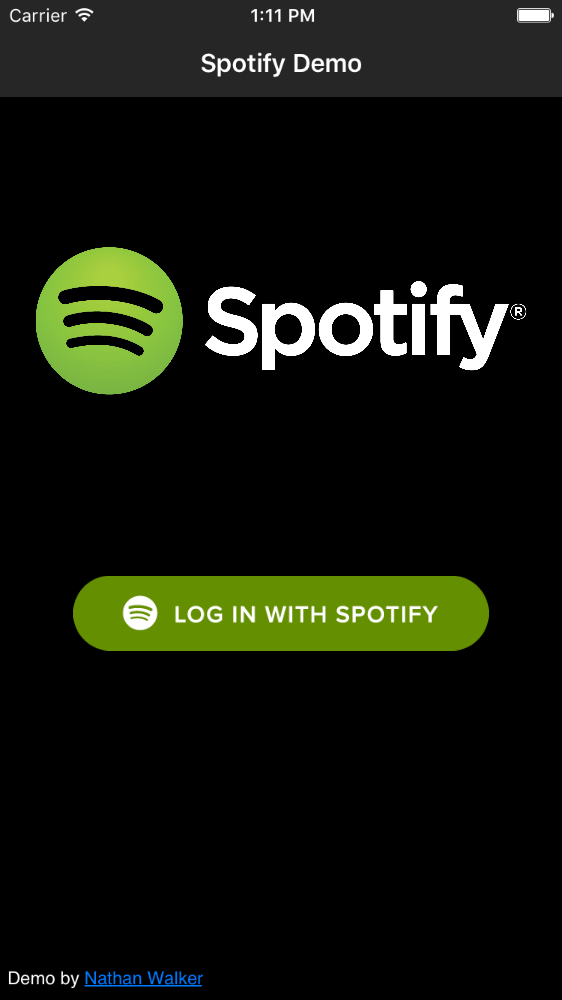
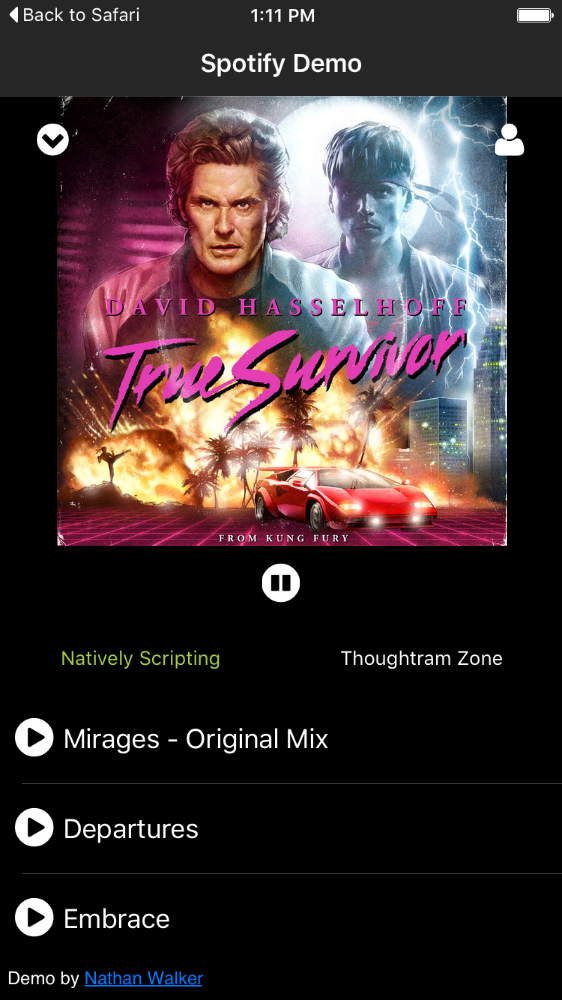
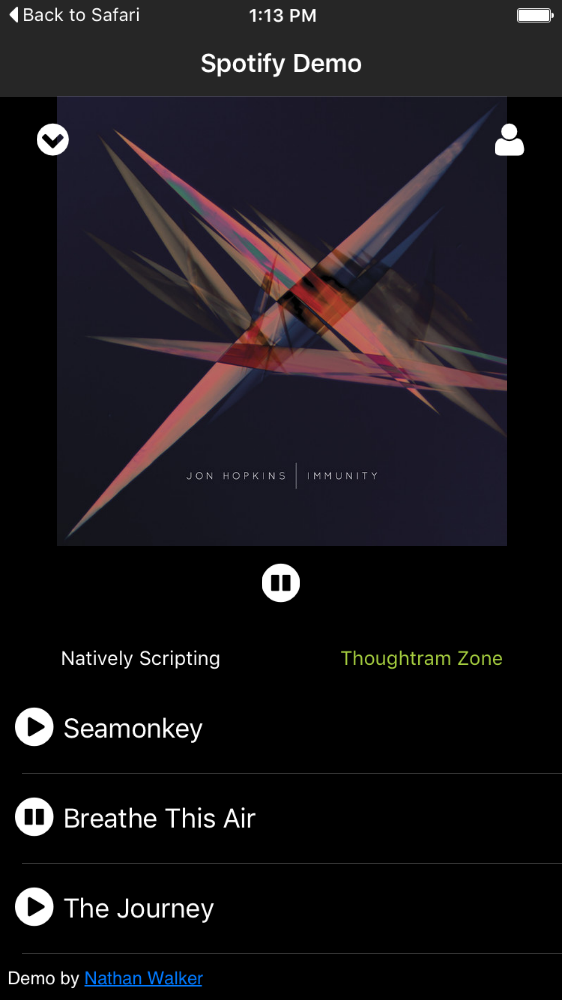

A NativeScript plugin for the Spotify iOS and (*coming soon* Android) SDK.

* [Install](#install)
* [Prerequisites](#prerequisites)
* [Usage](#usage)
* [Screenshots](#screenshots)
* [Documentation](#documentation)
* [Why the `TNS` prefixed name?](#why-the-tns-prefixed-name)
* [Try it/Contributing](https://github.com/NathanWalker/nativescript-spotify/blob/master/docs/CONTRIBUTING.md)

## Install

```
npm install nativescript-spotify --save
```

## Prerequisites

* Spotify streaming requires a **Premium** account.
* Create a Spotify Developer account here: https://developer.spotify.com/
* Create an app in your developer account and follow these instructions to get setup: https://developer.spotify.com/technologies/spotify-ios-sdk/tutorial/#creating-your-client-id-secret-and-callback-uri

## Usage

### Platform Prerequisites

#### iOS

* Modify `App_Resources/iOS/Info.plist`

Add a custom url scheme to handle the authentication callback. Add this to your `Info.plist`:

```
<key>CFBundleURLTypes</key>
<array>
  <dict>
    <key>CFBundleTypeRole</key>
    <string>Editor</string>
    <key>CFBundleURLName</key>
    <string>org.nativescript.demo</string>  // identifier of your app, the demo here uses this one
    <key>CFBundleURLSchemes</key>
    <array>
      <string>tnsspotify</string>  // your custom url scheme, the demo here uses this one
    </array>
  </dict>
</array>
```

### Setup

* app.ts

Configure application launch phases to setup your Spotify App CLIENT_ID and REDIRECT_URL (the one you created above in the developer account):

```
import * as application from 'application';
import {NSSpotifyConstants, NSSpotifyAuth} from 'nativescript-spotify';

class MyDelegate extends UIResponder implements UIApplicationDelegate {
  public static ObjCProtocols = [UIApplicationDelegate];
  
  public applicationDidFinishLaunchingWithOptions(application: UIApplication, launchOptions: NSDictionary): boolean {
    
    NSSpotifyConstants.CLIENT_ID = 'your spotify premium account api key';
    NSSpotifyAuth.REDIRECT_URL = 'tnsspotify://spotifylogin';  // your custom scheme
    return true;
  }
  
  public applicationOpenURLSourceApplicationAnnotation(application, url, sourceApplication, annotation) { 
    return NSSpotifyAuth.HANDLE_AUTH_CALLBACK(url);
  }
}
application.ios.delegate = MyDelegate;
application.mainModule = "main-page";
application.cssFile = "./app.css";
application.start();
```

* main-page.ts

```
import {SpotifyDemo} from "./main-view-model";

function pageLoaded(args) {
  var page = args.object;
  page.bindingContext = new SpotifyDemo();
}
exports.pageLoaded = pageLoaded;
```

* main-view-model.ts

```
import {Observable, EventData} from 'data/observable';
import {Page} from 'ui/page';
import {topmost} from 'ui/frame';
import {AnimationCurve} from 'ui/enums';
import * as loader from 'nativescript-loading-indicator';
import {TNSSpotifyConstants, TNSSpotifyAuth, TNSSpotifyPlayer, TNSSpotifyPlaylist, TNSSpotifyRequest, Utils} from 'nativescript-spotify';

export class SpotifyDemo extends Observable {
  private _spotify: TNSSpotifyPlayer;

  constructor() {
    super();
    
    this._spotify = new TNSSpotifyPlayer();
    
    // when using iOS delegates that extend NSObject, TypeScript constructors are not used, therefore a separate `initPlayer()` exists
    this._spotify.initPlayer(true); // passing `true` lets player know you want it to emit events (sometimes it's not desired)
    
    // small sample of events (see Documentation below for full list)
    this._spotify.audioEvents.on('albumArtChange', (eventData) => {
      this.updateAlbumArt(eventData.data.url);
    });
    this._spotify.audioEvents.on('authLoginSuccess', (eventData) => {
      this.loginSuccess();
    });
  }
  
  public login() {
    TNSSpotifyAuth.LOGIN();
  }
  
  public play(args?: EventData) {
    this._spotify.togglePlay('spotify:track:58s6EuEYJdlb0kO7awm3Vp').then((isPlaying: boolean) => {
      console.log(isPlaying ? 'Playing!' : 'Paused!');
    }, (error) => {
      console.log(`Playback error: ${error}`);
    });
  }
  
  private updateAlbumArt(url: string) {
    this.set(`currentAlbumUrl`, url);
  }
  
  private loginSuccess() {
    console.log(`loginSuccess!`);
  } 
}
```

## Screenshots

Sample 1 |  Sample 2
-------- | ---------
 | 

Sample 3 | Sample 4
-------- | -------
 | 

## Documentation

### TNSSpotifyPlayer

TNSSpotifyPlayer implements [SPTAudioStreamingPlaybackDelegate](https://developer.spotify.com/ios-sdk-docs/Documents/Protocols/SPTAudioStreamingPlaybackDelegate.html).

Creating:
```
// Option 1: simple
this.spotify = new TNSSpotifyPlayer();
this.spotify.initPlayer();

// Option 2: advanced
this.spotify = new TNSSpotifyPlayer();
// passing `true` will let the player know it should emit events
this.spotify.initPlayer(true);

// it allows you to listen to events like so:
this.spotify.audioEvents.on('startedPlayingTrack', (event) => {
  console.log(event.data.url); // spotify track url
});

// play/pause a track
this.spotify.togglePlay('spotify:track:58s6EuEYJdlb0kO7awm3Vp').then((isPlaying: boolean) => {
  console.log(isPlaying ? 'Playing!' : 'Paused!');
}, (error) => {
  console.log(`Playback error: ${error}`);
});
```

#### Methods

Method |  Description
-------- | ---------
`togglePlay(track?: string)`: `Promise<any>` | Allows toggle play/pause on a track, or changing a track. `track` must be a valid spotify track uri. [Learn more here](https://developer.spotify.com/web-api/user-guide/#spotify-uris-and-ids) 
`isPlaying()`: `boolean` | Determine if player is currently playing
`isLoggedIn()`: `boolean` | Determine if player is authenticated
`loadedTrack()`: `string` | Determine current loaded track (spotify track uri)
`currentTrackMetadata()`: `TNSSpotifyTrackMetadataI` | Get the current track's metadata. [Learn more here](https://developer.spotify.com/ios-sdk-docs/Documents/Classes/SPTAudioStreamingController.html#//api/name/currentTrackMetadata)

#### Events

Event |  Description
-------- | ---------
`authLoginChange` | Sends along `data` = `status: boolean` When auth state changes.
`authLoginCheck` | When auth callback has returned and is verifying authentication
`authLoginSuccess` | When auth succeeded
`albumArtChange` | Sends along `data` = `url: string` When track triggers a play start, this will also trigger to send along the correct album art of the track.
`playerReady` | When the session has been validated and the player is ready to play.
`changedPlaybackStatus` | Sends along `data` = `playing: boolean` When playback state changes.
`seekedToOffset` | Sends along `data` = `offset: number` When player has seeked to a given offset.
`changedVolume` | Sends along `data` = `volume: number` When the player volume was changed.
`changedShuffleStatus` | Sends along `data` = `shuffle: number` When shuffle setting was changed.
`changedRepeatStatus` | Sends along `data` = `repeat: number` When repeat setting was changed.
`changedToTrack` | Sends along `data` = `metadata: any` When track change occurs.
`failedToPlayTrack` | Sends along `data` = `url: string` When track play fails. Provides the url of the track that failed.
`startedPlayingTrack` | Sends along `data` = `url: string` When track play starts. Provides the url of the track that started.
`stoppedPlayingTrack` | Sends along `data` = `url: string` When track play stops. Provides the url of the track that stopped.
`skippedToNextTrack` | When player skipped to next track.
`skippedToPreviousTrack` | When player skipped to previous track.
`activePlaybackDevice` | When the audio streaming object becomes the active playback device on the user’s account.
`inactivePlaybackDevice` | When the audio streaming object becomes an inactive playback device on the user’s account.
`poppedQueue` | When the audio streaming object becomes an inactive playback device on the user’s account.

### TNSSpotifyAuth

TNSSpotifyAuth

Provides `static` methods to help with authentication handling and user management.

#### Methods

Method |  Description
-------- | ---------
`LOGIN()`: `void` | Initiates login sequence.
`LOGOUT()`: `void` | Clear's persisted user session and notifies of login change.
`HANDLE_AUTH_CALLBACK(url)`: `boolean` | Used in application launch phase to handle the auth redirect back into the app.
`INIT_SESSION()`: `Promise<any>` | Mainly used internally, but used to restore a session from local persistence and/or renew.
`SAVE_SESSION(session)`: `void` | Mainly used internally, but can be used to persist a valid Spotify session.
`GET_STORED_SESSION()`: `any` | Get the current user's session. [Learn more here](https://developer.spotify.com/ios-sdk-docs/Documents/Classes/SPTSession.html)
`RENEW_SESSION(session)`: `Promise<any>` | Can be used to pass an expired session to renew it.
`CURRENT_USER()`: `Promise<any>` | Get the current user object. [Learn more here](https://developer.spotify.com/ios-sdk-docs/Documents/Classes/SPTUser.html)

## Why the TNS prefixed name?

`TNS` stands for **T**elerik **N**ative**S**cript

iOS uses classes prefixed with `NS` (stemming from the [NeXTSTEP](https://en.wikipedia.org/wiki/NeXTSTEP) days of old):
https://developer.apple.com/library/mac/documentation/Cocoa/Reference/Foundation/Classes/NSString_Class/

To avoid confusion with iOS native classes, `TNS` is used instead.

## License

MIT
