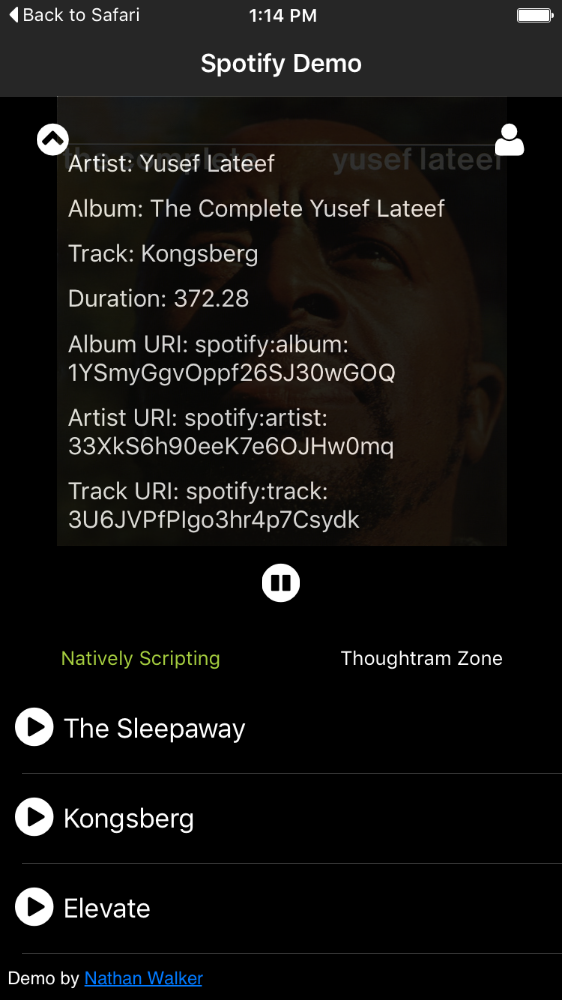

A NativeScript plugin for the iOS and (*coming soon* Android) Spotify SDK.

* [Install](#install)
* [Prerequisites](#prerequisites)
* [Usage](#usage)
* [Screenshots](#screenshots)
* [TNSSpotifyPlayer](#tnsspotifyplayer)
* [Why the `TNS` prefixed name?](#why-the-tns-prefixed-name)
* [Try it/Contributing](https://github.com/NathanWalker/nativescript-spotify/blob/master/docs/CONTRIBUTING.md)

## Install

```
npm install nativescript-spotify --save
```

## Prerequisites

* Spotify streaming requires a **Premium** account.
* Create a Spotify Developer account here: https://developer.spotify.com/
* Create an app in your developer account and follow these instructions to get setup: https://developer.spotify.com/technologies/spotify-ios-sdk/tutorial/#creating-your-client-id-secret-and-callback-uri

## Usage

* Modify `App_Resources/iOS/Info.plist`

Add a custom url scheme to handle the authentication callback. Add this to your `Info.plist`:

```
<key>CFBundleURLTypes</key>
	<array>
		<dict>
			<key>CFBundleTypeRole</key>
			<string>Editor</string>
			<key>CFBundleURLName</key>
			<string>org.nativescript.demo</string>  // identifier of your app, the demo here uses this one
			<key>CFBundleURLSchemes</key>
			<array>
				<string>tnsspotify</string>  // your custom url scheme, the demo here uses this one
			</array>
		</dict>
	</array>
```

* app.ts

Configure application launch phases to setup your CLIENT_ID (spotify premium api key) and REDIRECT_URL:

```
import * as application from 'application';
import {NSSpotifyConstants, NSSpotifyAuth} from 'nativescript-spotify';

class MyDelegate extends UIResponder implements UIApplicationDelegate {
  public static ObjCProtocols = [UIApplicationDelegate];
  
  public applicationDidFinishLaunchingWithOptions(application: UIApplication, launchOptions: NSDictionary): boolean {
    
    NSSpotifyConstants.CLIENT_ID = 'your spotify premium account api key';
    NSSpotifyAuth.REDIRECT_URL = 'tnsspotify://spotifylogin';  // your custom scheme
    return true;
  }
  
  public applicationOpenURLSourceApplicationAnnotation(application, url, sourceApplication, annotation) { 
    return NSSpotifyAuth.HANDLE_AUTH_CALLBACK(url);
  }
}
application.ios.delegate = MyDelegate;
application.mainModule = "main-page";
application.cssFile = "./app.css";
application.start();
```

* main-page.ts

```
import {SpotifyDemo} from "./main-view-model";

function pageLoaded(args) {
  var page = args.object;
  page.bindingContext = new SpotifyDemo();
}
exports.pageLoaded = pageLoaded;
```

* main-view-model.ts

```

```

## Screenshots

Sample 1 |  Sample 2
-------- | ---------
 | 

Sample 3 | Sample 4
-------- | -------
 | 

## TNSSpotifyPlayer

TNSSpotifyPlayer implements of [SPTAudioStreamingPlaybackDelegate](https://developer.spotify.com/ios-sdk-docs/Documents/Protocols/SPTAudioStreamingPlaybackDelegate.html).

Creating:
```
// Option 1: simple
this.spotify = new TNSSpotifyPlayer();
this.spotify.initPlayer();

// Option 2: advanced
this.spotify = new TNSSpotifyPlayer();
// passing `true` will let the player know it should emit events
this.spotify.initPlayer(true);

// it allows you to listen to events like so:
this.spotify.audioEvents.on('startedPlayingTrack', (event) => {
  console.log(event.data.url); // spotify track url
});
```

#### Methods

Event |  Description
-------- | ---------
`togglePlay(fileName?: string, reloadTrack?: boolean)`: `void` | Allows toggle play/pause on a track as well as reloading the current track or reloading in a new track. First time will always load the track and play. `fileName` represents the path to the file in your resources. `reloadTrack` can be used to reload current track or load a new track.
`pause()`: `void` | Pause track
`isPlaying()`: `boolean` | Determine whether player is playing a track
`duration()`: `number` | Length in seconds
`formattedDuration()`: `string` | Formatted duration in '00:00'
`totalFrames`: `number` | Total number of frames in the loaded track
`formattedCurrentTime`: `string` | Formatted current time in '00:00'
`setCurrentTime(time: number)`: `void` | Set the current time via a frame number
`seekToFrame(frame: number)`: `void` | Seek playhead to a given frame number
`volume()`: `number` | Get the current volume
`setVolume(volume: number)`: `void` | Set the volume. Must be between 0 - 1.
`pan()`: `number` | Get current pan settings
`setPan(pan: number)`: `void` | Set pan left/right. Must be between -1 (left) and 1 (right). 0 is default (center). 
`device()`: `any` | Get current output device

#### Events

Event |  Description
-------- | ---------
`audioBuffer` | When audio file is playing, get the `buffer` and `bufferSize` to set an `AudioPlot`'s `bufferData`
`position` | Current frame number
`reachedEnd` | When the end of the file is reached
`changeAudioFile` | When the audio file is changed or set
`changeOutput` | When the output device is changed
`changePan` | When the pan is changed
`changeVolume` | When the volume is changed
`changePlayState` | When the player state changes, ie. play/pause
`seeked` | When the audio file has been seeked to a certain frame number

## Why the TNS prefixed name?

`TNS` stands for **T**elerik **N**ative**S**cript

iOS uses classes prefixed with `NS` (stemming from the [NeXTSTEP](https://en.wikipedia.org/wiki/NeXTSTEP) days of old):
https://developer.apple.com/library/mac/documentation/Cocoa/Reference/Foundation/Classes/NSString_Class/

To avoid confusion with iOS native classes, `TNS` is used instead.

## License

MIT
